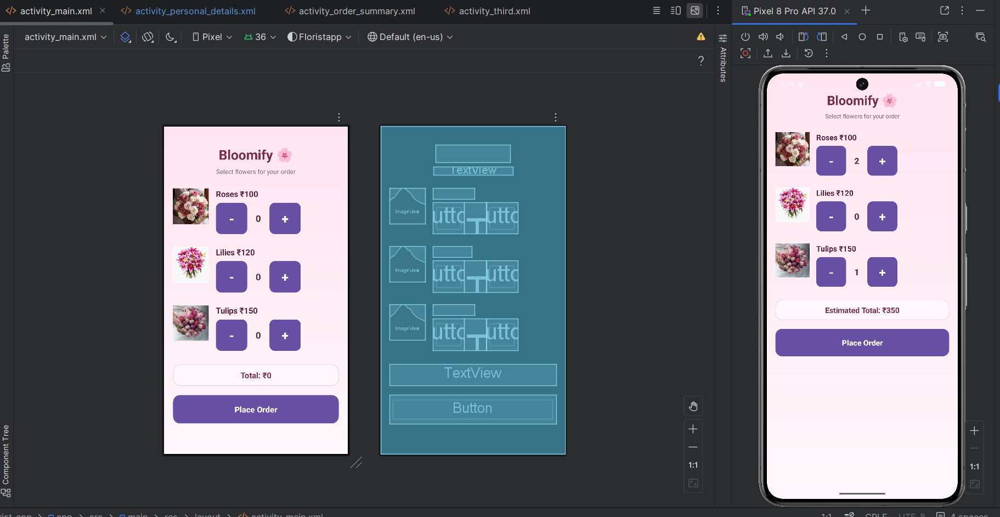
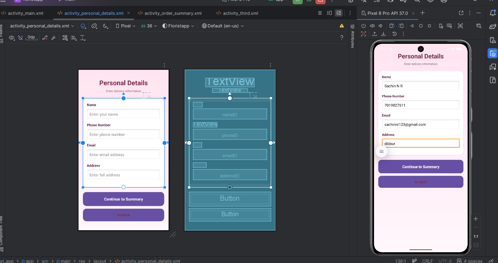
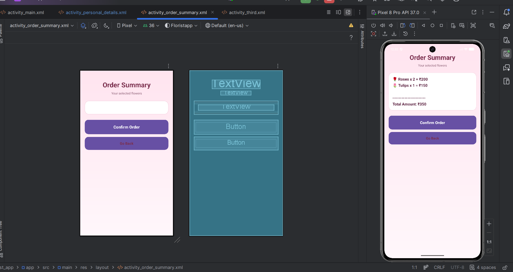
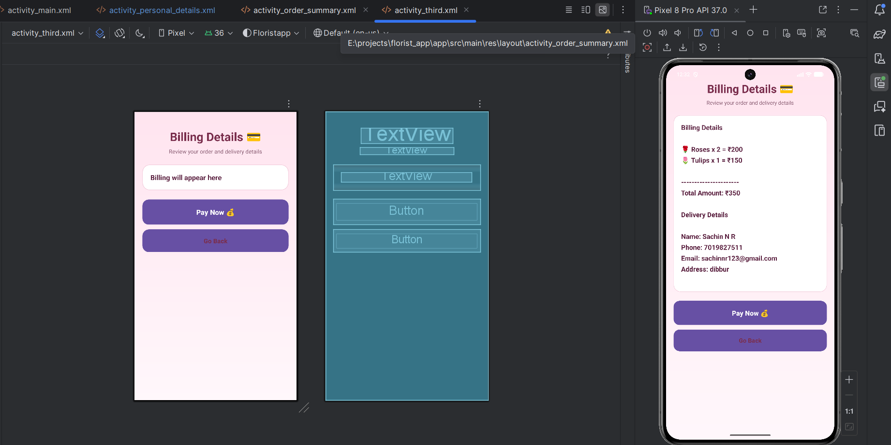

# Bloomify 🌸
A simple flower ordering Android app built using **Java** and **Android Studio**.  
This mini project lets users select flowers, enter personal delivery details, view order summary, and see the final billing screen.

---

## 📱 Project Flow
1. **MainActivity** – Select flowers and quantity  
2. **PersonalDetailsActivity** – Enter delivery details  
3. **OrderSummaryActivity** – View flower order summary  
4. **ThirdActivity** – View final billing with personal details  

---

## ✨ Features
- Flower selection with quantity controls
- Live total calculation
- Personal details form
- Order summary screen
- Final billing screen
- Back button support on every screen
- Clean and simple UI
- Flower images displayed in the main screen

---

## 🛠️ Tech Stack
- **Language:** Java
- **IDE:** Android Studio
- **Layout:** XML
- **UI Components:** ConstraintLayout, ScrollView, Button, TextView, EditText, ImageView, RadioGroup, RadioButton

---

## 📂 Project Structure
```text
app/
 └── src/
     └── main/
         ├── java/com/example/floristapp/
         │   ├── MainActivity.java
         │   ├── PersonalDetailsActivity.java
         │   ├── OrderSummaryActivity.java
         │   └── ThirdActivity.java
         │
         ├── res/
         │   ├── layout/
         │   │   ├── activity_main.xml
         │   │   ├── activity_personal_details.xml
         │   │   ├── activity_order_summary.xml
         │   │   └── activity_third.xml
         │   │
         │   ├── drawable/
         │   │   ├── bg_screen.xml
         │   │   ├── bg_card.xml
         │   │   ├── bg_button_primary.xml
         │   │   ├── bg_button_small.xml
         │   │   ├── bg_total.xml
         │   │   ├── rose.webp
         │   │   ├── lilly.webp
         │   │   └── tulip.webp
         │   │
         │   └── values/
         │       ├── strings.xml
         │       ├── colors.xml
         │       └── themes.xml
         │
         └── AndroidManifest.xml
```

## 🚀 How It Works

### 1. Main Screen
- User selects flowers:
  - Roses
  - Lilies
  - Tulips
- User increases or decreases quantity using `+` and `-`
- Total amount updates automatically
- Clicking **Place Order** opens the Personal Details screen

### 2. Personal Details Screen
- User enters:
  - Name
  - Phone number
  - Email
  - Address
- Clicking **Continue to Summary** opens the Order Summary screen

### 3. Order Summary Screen
- Shows selected flowers and total amount
- Clicking **Confirm Order** opens the Billing screen

### 4. Billing Screen
- Shows flower details
- Shows personal delivery details
- Clicking **Pay Now** shows a success toast

---

## ✅ Validations
- Name cannot be empty
- Phone number must be valid
- Email cannot be empty
- Address cannot be empty
- At least one flower must be selected before proceeding

---

## 🎨 UI Design Notes
- Soft pink floral background
- Card-style content sections
- Rounded buttons
- Big visible `+` and `-` buttons
- Extra spacing at the top for better appearance
- Full-screen scrollable layouts

---

## 🧾 Requirements
- Android Studio
- Android SDK
- Emulator or real Android device
- Minimum Android version depends on your project configuration

---

## ▶️ How to Run
1. Open the project in Android Studio
2. Wait for Gradle sync to complete
3. Make sure all drawables and XML IDs are correct
4. Run the app on an emulator or phone
5. Select flowers and continue through all screens

---

## 📌 Important Files to Check

### Java Files
- `MainActivity.java`
- `PersonalDetailsActivity.java`
- `OrderSummaryActivity.java`
- `ThirdActivity.java`

### XML Files
- `activity_main.xml`
- `activity_personal_details.xml`
- `activity_order_summary.xml`
- `activity_third.xml`

### Manifest
- `AndroidManifest.xml`

---

## 🔧 Important IDs Used

### activity_main.xml
- `roseQty`
- `lilyQty`
- `tulipQty`
- `totalText`
- `orderBtn`

### activity_personal_details.xml
- `nameEt`
- `phoneEt`
- `emailEt`
- `addressEt`
- `nextBtn`
- `backBtn`

### activity_order_summary.xml
- `summaryText`
- `placeOrderBtn`
- `backBtn`

### activity_third.xml
- `billText`
- `payBtn`
- `backBtn`

---

## 📷 Screenshots

### 🌸 Main Screen


### 🧾 Personal Details Screen


### 📋 Order Summary Screen


### 💳 Billing Screen


---

## 🧠 Learning Outcomes
This project helped me understand:
- Android activity navigation
- Intent data passing
- Form validation
- XML layout design
- UI styling with drawable backgrounds
- Handling button click events
- Passing data between multiple activities

---

## 👩‍💻 Future Improvements
- Add payment gateway
- Store orders in Firebase
- Add more flower categories
- Add order tracking
- Add cart screen
- Add order history
- Add login system

---

## 📄 License
This project is created for learning and academic mini-project purposes.

---

## 🙌 Acknowledgement
Built as a mini project for Android app development practice.
